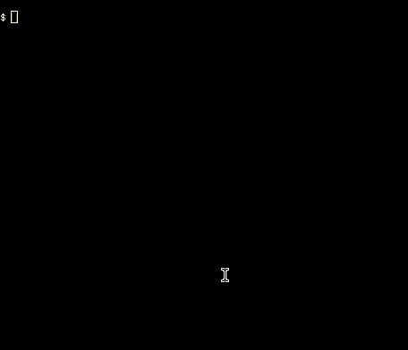

# rastermizer
View 3D models in the terminal.



## Build & Run
Have [Stack](https://docs.haskellstack.org/) installed.

```bash
stack run -- --help
stack run -- data/dragon-head.ply
stack run -- data/rashsar.ply --fov 45
```

Drag the left mouse button to rotate the view.
Exit with `Ctrl+C`.
Tested with `xfce4-terminal` on Linux.

## Supported formats
This program expects a very specific form of PLY or COLLADA from which to load
a 3D mesh.
Vertex colors and normals must be provided.

See `data/` for examples.
